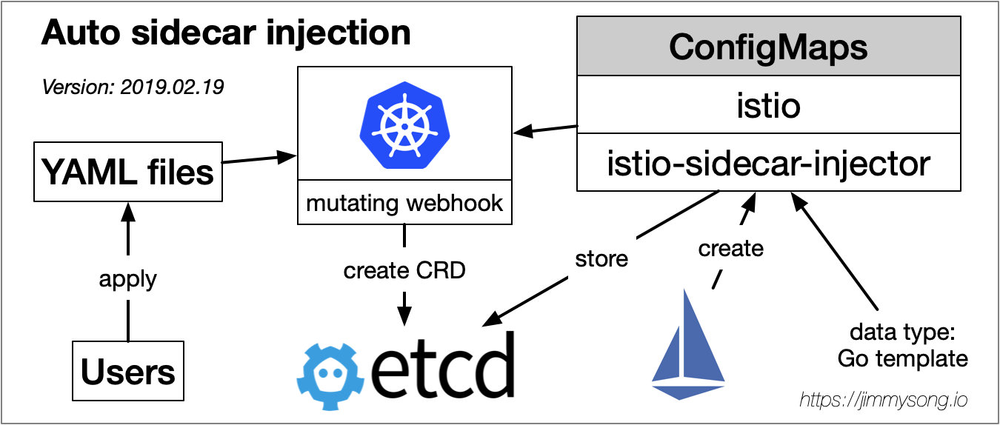

# Sidecar 的自动注入过程详解

在 [Sidecar 注入与流量劫持详解](../concepts/concepts/sidecar-injection-deep-dive.md)中我只是简单介绍了 Sidecar 注入的步骤，但是没有涉及到具体的 Sidecar 注入流程与细节，这一篇将带大家了解 Istio 为数据平面自动注入 Sidecar 的详细过程。

## Sidecar 注入过程

如 Istio 官方文档中对 [Istio sidecar 注入](https://istio.io/latest/zh/docs/setup/additional-setup/sidecar-injection/)的描述，你可以使用 istioctl 命令手动注入 Sidecar，也可以为 Kubernetes 集群自动开启 sidecar 注入，这主要用到了 [Kubernetes 的准入控制器](https://jimmysong.io/kubernetes-handbook/concepts/admission-controller.html)中的 webhook，参考 Istio 官网中对 [Istio sidecar 注入](https://istio.io/latest/zh/docs/setup/additional-setup/sidecar-injection/)的描述。

### 手动注入 sidecar 与自动注入 sidecar 的区别

不论是手动注入还是自动注入，sidecar 的注入过程有需要遵循如下步骤：

1. Kubernetes 需要了解待注入的 sidecar 所连接的 Istio 集群及其配置；

2. Kubernetes 需要了解待注入的 sidecar 容器本身的配置，如镜像地址、启动参数等；

3. Kubernetes 根据 sidecar 注入模板和以上配置填充 sidecar 的配置参数，将以上配置注入到应用容器的一侧；

Istio 和 sidecar 配置保存在 `istio` 和 `istio-sidecar-injector` 这两个 ConfigMap 中，其中包含了 Go template，所谓自动 sidecar 注入就是将生成 Pod 配置从应用 YAML 文件期间转移到 [mutable webhook](https://jimmysong.io/kubernetes-handbook/concepts/admission-controller.html) 中。

## 参考

- [注入 Istio sidecar - istio.io](https://istio.io/latest/zh/docs/setup/additional-setup/sidecar-injection/)
