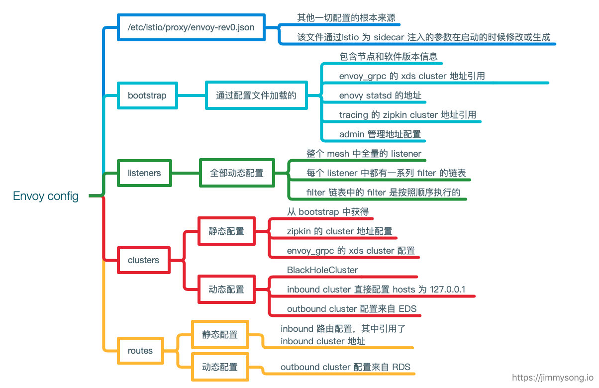

# Istio sidecar proxy 配置

假如您使用 [kubernetes-vagrant-centos-cluster](https://github.com/rootsongjc/kubernetes-vagrant-centos-cluster) 部署了 Kubernetes 集群并开启了 [Istio Service Mesh](https://istio.io/zh)，再部署 [bookinfo 示例](https://istio.io/zh/docs/examples/bookinfo/)，那么在 `default` 命名空间下有一个名字类似于 `ratings-v1-7c9949d479-dwkr4` 的 Pod，使用下面的命令查看该 Pod 的 Envoy sidecar 的全量配置：

```bash
kubectl -n default exec ratings-v1-7c9949d479-dwkr4 -c istio-proxy curl http://localhost:15000/config_dump > dump-rating.json
```

将 Envoy 的运行时配置 dump 出来之后你将看到一个长 6000 余行的配置文件。关于该配置文件的介绍请参考 [Envoy v2 API 概览](http://www.servicemesher.com/envoy/configuration/overview/v2_overview.html)。

下图展示的是 Enovy 的配置。



Istio 会在为 Service Mesh 中的每个 Pod 注入 Sidecar 的时候同时为 Envoy 注入 Bootstrap 配置，其余的配置是通过 Pilot 下发的，注意整个数据平面即 Service Mesh 中的 Envoy 的动态配置应该是相同的。您也可以使用上面的命令检查其他 sidecar 的 Envoy 配置是否跟最上面的那个相同。

使用下面的命令检查 Service Mesh 中的所有有 Sidecar 注入的 Pod 中的 proxy 配置是否同步。

```bash
$ istioctl proxy-status
PROXY                                                 CDS        LDS        EDS               RDS          PILOT                            VERSION
details-v1-876bf485f-sx7df.default                    SYNCED     SYNCED     SYNCED (100%)     SYNCED       istio-pilot-5bf6d97f79-6lz4x     1.0.0
...
```

[istioctl](https://istio.io/zh/docs/reference/commands/istioctl/) 这个命令行工具就像 [kubectl](https://jimmysong.io/kubernetes-handbook/guide/kubectl-cheatsheet.html) 一样有很多神器的魔法，通过它可以高效的管理 Istio 和 debug。

## 参考

- [kubernetes-vagrant-centos-cluster - github.com](https://github.com/rootsongjc/kubernetes-vagrant-centos-cluster)
